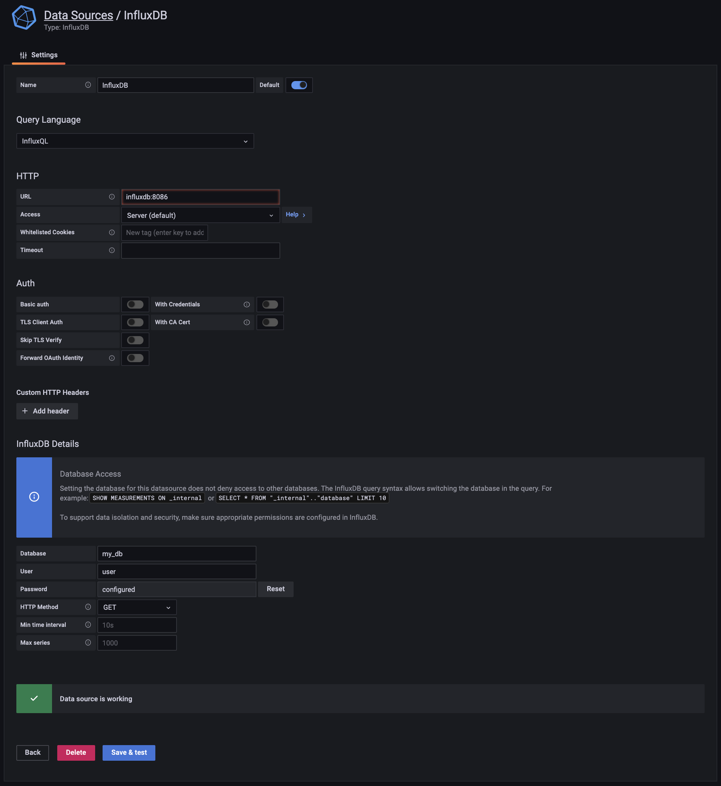

# influxdb-grafana

## Start
```
$ docker-compose up -d
```

## Open Grafana
```
http://localhost:3000/
```

## Setup Datasource


## Test
```
$ pip install -r requirements.txt
$ python test.py
```


## influx shell
```
$ docker exec -it influxdb bash
root@xxx:/# influx -username user -password password

> show databases
name: databases
name
----
dbname

> use dbname
Using database dbname

> show measurements
name: measurements
name
----
meas

> SELECT * FROM meas
name: meas
time                tag     unit_1 unit_2 unit_3 unit_4 unit_5 unit_6 unit_7 unit_8 unit_9
----                ---     ------ ------ ------ ------ ------ ------ ------ ------ ------
1629957031877447000 tagname 1      1      0      1      1      0      0      0      1
1629957039594708000 tagname 1      0      0      0      0      0      0      0      1
1629957041550926000 tagname 0      1      0      0      1      0      1      1      1
1629957042575417000 tagname 1      0      0      0      0      1      1      1      0
1629957043605758000 tagname 1      1      0      0      1      1      0      0      0
1629957044628510000 tagname 1      1      1      0      0      0      0      0      1
```